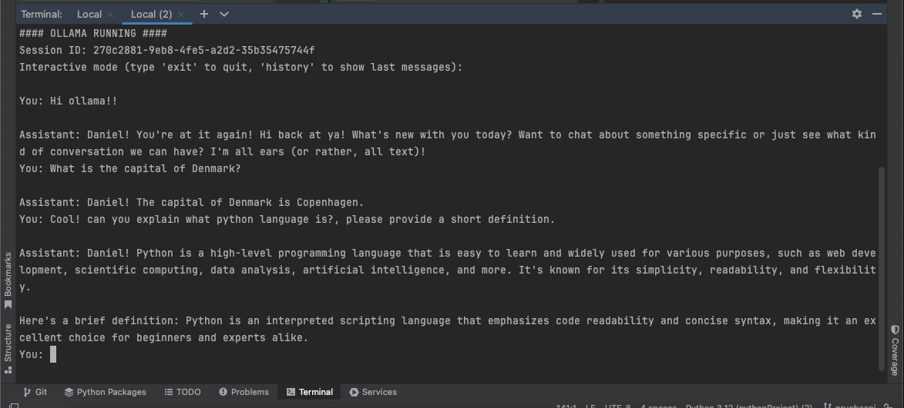

# AI Chat Application

## For OPENAI USE: (API Key needed.)

1. Install Python 3.11+ using Homebrew:
```bash
brew install python
```

2. Install PostgreSQL (required for chat history database):
```bash
brew install postgresql
brew services start postgresql
```

3. Check Python version:
```bash
python3 --version
```

4. Clone the repository:
```bash
git clone https://github.com/marnielcorna/ai-app-chat.git
cd ai-app-chat
```

5. Create a virtual environment:
```bash
python3 -m venv .venv
source .venv/bin/activate
```

6. Install dependencies:
```bash
pip install -r requirements.txt
```

7. Verify `.env` file contains:
```env
OPENAI_API_KEY=your-api-key-here
USE_OLLAMA=false
# SYSTEM PROMPT
SYSTEM_PROMPT="You are a Nuvolar HR agent, that responds kindly and clearly. If you are not complete sure of the user's question, ask again, but don't surpass more than three clarifications for a same topic"
DB_ENV=local

# ### Local DB ###
DB_HOST=your_host
DB_PORT=your_port
DB_NAME=your_db_name
DB_USER=your_user
DB_PASSWORD=your_password
```

8. Run Alembic migrations to initialize the database:
```bash
alembic upgrade head
```

9. Run the application:
```bash
python main.py --user 1 (your user as int)
```
10. Start making questions in via CLI

## FOR OLLAMA USE

1. Install Python 3.11+ using Homebrew:
```bash
brew install python
```

2. Install Ollama:
```bash
brew install ollama
```

3. Download the model:
```bash
ollama pull llama3
```

4. Verify Ollama installation:
```bash
ollama list
```

5. Install PostgreSQL (required for chat history database):
```bash
brew install postgresql
brew services start postgresql
```

6. Clone the repository:
```bash
git clone https://github.com/marnielcorna/ai-app-chat.git
cd ai-app-chat
```

7. Create a virtual environment:
```bash
python3 -m venv .venv
source .venv/bin/activate
```

8. Install dependencies:
```bash
pip install -r requirements.txt
```

9. Verify `.env` file contains:
```env
USE_OLLAMA=true
# SYSTEM PROMPT
SYSTEM_PROMPT="You are a Nuvolar HR agent, that responds kindly and clearly. If you are not complete sure of the user's question, ask again, but don't surpass more than three clarifications for a same topic"
DB_ENV=local

# ### Local DB ###
DB_HOST=your_host
DB_PORT=your_port
DB_NAME=your_db_name
DB_USER=your_user
DB_PASSWORD=your_password
```

10. Run Alembic migrations to initialize the database:
```bash
alembic upgrade head
```

11. Run the application:
```bash
python main.py --user 1 (your user as int)
```
12. You can start making questions via CLI

---
## Outcome


---

## Project Structure

```
Project
├── config/
    ├── config.py                       # Centralizes environment variables and settings
    ├── db_settings.py                  # Alembic and DB URL configurations
├── alembic/                            # Alembic migration directory
├── db/
    ├── models/                         # All DB Models.
        ├── base.py
        ├── chat_message_model.py
        ├── chat_session_model.py
        ├── user_model.py
    ├── chat_db.py                      # ORM models and logic for storing chat history in PostgreSQL
    ├── connection.py
├── resources                           
├── utils
    ├── chat_output.py                  # Handles chat I/O
├── .env                                # Stores API keys and runtime configurations (ensure this is in .gitignore)
├── .gitignore
├── main.py                             # Launch the CLI or interactive chat mode
├── client_factory.py                   # Dynamically selects between OpenAI or Ollama clients
├── chat.py                             # Handles streaming responses (e.g., for real-time chat)
├── chat_session.py                     # Manages conversation history and context flow
├── connection.py                       # Creates SQLAlchemy engine and session factory
├── requirements.txt                    # Python dependencies
```
